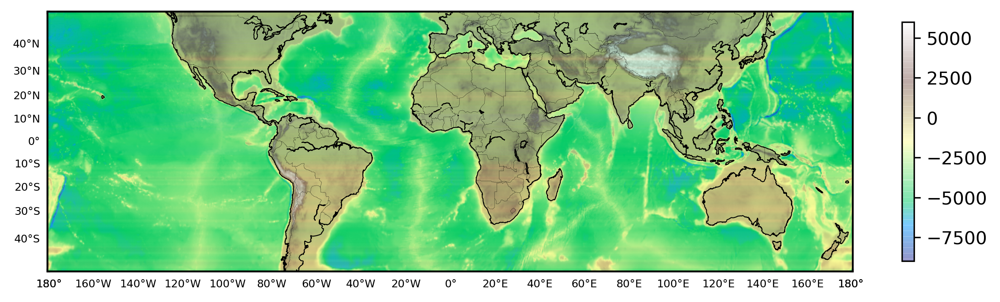
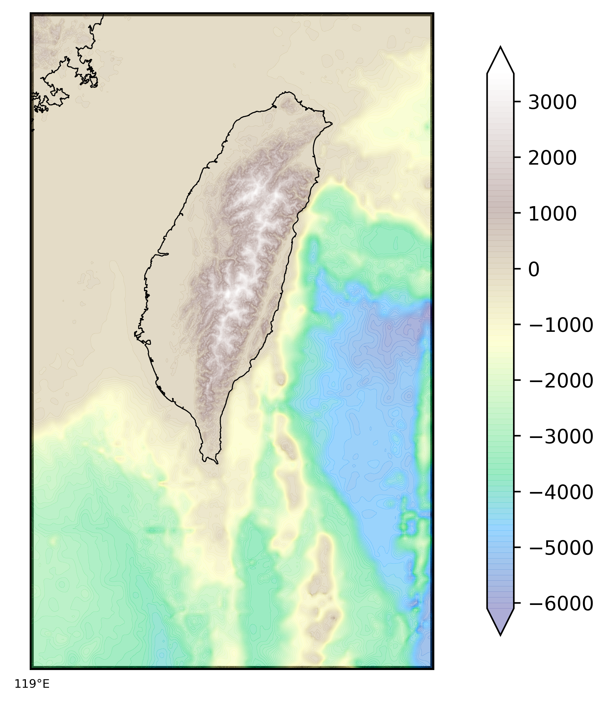

# Plotting Topographic Maps using Python
- uses basemap
- uses topo data in the directory `topo`
- use topographic data from `ETOPO1_Bed_g_gmt4.grd` file from NOAA (or any netcdf topo file). Download data from [here](https://www.ngdc.noaa.gov/mgg/global/).


## World Map
```
## World map
lonmin, lonmax = -180,180
latmin, latmax = -50,50

fig = plt.figure(figsize=(10,6))
ax = fig.add_subplot(111)
map = Basemap(projection='merc',resolution = 'l', area_thresh = 10000., llcrnrlon=lonmin, llcrnrlat=latmin,urcrnrlon=lonmax, urcrnrlat=latmax)
cs = plot_topo(map,cmap='terrain',lonextent=(lonmin, lonmax),latextent=(latmin, latmax),zorder=2)
fig.colorbar(cs, ax=ax, shrink=0.4)
map.drawcoastlines(color='k',linewidth=0.5)
map.drawcountries(color='k',linewidth=0.1)
# map.drawstates(color='gray',linewidth=0.05)
# map.drawrivers(color='blue',linewidth=0.05)
parallelmin = int(latmin)
parallelmax = int(latmax)+1
map.drawparallels(np.arange(parallelmin, parallelmax,10,dtype='int16').tolist(),labels=[1,0,0,0],linewidth=0,fontsize=6)

meridianmin = int(lonmin)
meridianmax = int(lonmax)+1
map.drawmeridians(np.arange(meridianmin, meridianmax,20,dtype='int16').tolist(),labels=[0,0,0,1],linewidth=0,fontsize=6)

map.drawmapboundary(color='k', linewidth=2, zorder=1)

plt.savefig('world_map.png',bbox_inches='tight',dpi=300)
plt.close('all')
```


## Africa Map 
```
## Map1
lonmin, lonmax = -30,70
latmin, latmax = -40,40

fig = plt.figure(figsize=(10,6))
ax = fig.add_subplot(111)
map = Basemap(projection='merc',resolution = 'l', area_thresh = 10000., llcrnrlon=lonmin, llcrnrlat=latmin,urcrnrlon=lonmax, urcrnrlat=latmax)
cs = plot_topo(map,cmap='terrain',lonextent=(lonmin, lonmax),latextent=(latmin, latmax),zorder=2)
fig.colorbar(cs, ax=ax, shrink=0.9)
map.drawcoastlines(color='k',linewidth=0.5)
map.drawcountries(color='k',linewidth=0.1)
map.drawstates(color='gray',linewidth=0.05)
map.drawrivers(color='blue',linewidth=0.05)
parallelmin = int(latmin)
parallelmax = int(latmax)+1
map.drawparallels(np.arange(parallelmin, parallelmax,10,dtype='int16').tolist(),labels=[1,0,0,0],linewidth=0)

meridianmin = int(lonmin)
meridianmax = int(lonmax)+1
map.drawmeridians(np.arange(meridianmin, meridianmax,20,dtype='int16').tolist(),labels=[0,0,0,1],linewidth=0)

map.drawmapboundary(color='k', linewidth=2, zorder=1)

plt.savefig('africa.png',bbox_inches='tight',dpi=300)
plt.close('all')
```


## Africa Etopo (NOAA):
```
lonmin, lonmax = -30,70
latmin, latmax = -40,40

fig = plt.figure(figsize=(10,6))
ax = fig.add_subplot(111)
map = Basemap(projection='merc',resolution = 'l', area_thresh = 10000., llcrnrlon=lonmin, llcrnrlat=latmin,urcrnrlon=lonmax, urcrnrlat=latmax)
cs = plot_topo_netcdf(map,etopo_file='ETOPO1_Bed_g_gmt4.grd',cmap='terrain',lonextent=(lonmin, lonmax),latextent=(latmin, latmax),zorder=2)
fig.colorbar(cs, ax=ax, shrink=0.4)
map.drawcoastlines(color='k',linewidth=0.5)
map.drawcountries(color='k',linewidth=0.1)

parallelmin,parallelmax = int(latmin), int(latmax)+1
map.drawparallels(np.arange(parallelmin, parallelmax+1,10,dtype='int16').tolist(),labels=[1,0,0,0],linewidth=0,fontsize=6)
meridianmin,meridianmax = int(lonmin),int(lonmax)+1
map.drawmeridians(np.arange(meridianmin, meridianmax+1,20,dtype='int16').tolist(),labels=[0,0,0,1],linewidth=0,fontsize=6)
map.drawmapboundary(color='k', linewidth=2, zorder=1)
plt.savefig('test_africa.png',bbox_inches='tight',dpi=600)
plt.close('all')
```


## Taiwan Plot
```
### ETOPO TAIWAN
lonmin, lonmax = 119,123
latmin, latmax = 20,26

fig = plt.figure(figsize=(10,6))
ax = fig.add_subplot(111)
map = Basemap(projection='merc',resolution = 'f', area_thresh = 1000., llcrnrlon=lonmin, llcrnrlat=latmin,urcrnrlon=lonmax, urcrnrlat=latmax)
cs = plot_topo_netcdf(map,etopo_file='ETOPO1_Bed_g_gmt4.grd',cmap='terrain',lonextent=(lonmin, lonmax),latextent=(latmin, latmax),zorder=2)
fig.colorbar(cs, ax=ax, shrink=0.9)

map.drawcoastlines(color='k',linewidth=0.5)
map.drawcountries(color='k',linewidth=0.1)
parallelmin,parallelmax = int(latmin), int(latmax)+1
map.drawparallels(np.arange(parallelmin, parallelmax+1,10,dtype='int16').tolist(),labels=[1,0,0,0],linewidth=0,fontsize=6)
meridianmin,meridianmax = int(lonmin),int(lonmax)+1
map.drawmeridians(np.arange(meridianmin, meridianmax+1,20,dtype='int16').tolist(),labels=[0,0,0,1],linewidth=0,fontsize=6)

map.drawmapboundary(color='k', linewidth=2, zorder=1)
plt.savefig('taiwan_plot.png',bbox_inches='tight',dpi=600)
plt.close('all')
```

